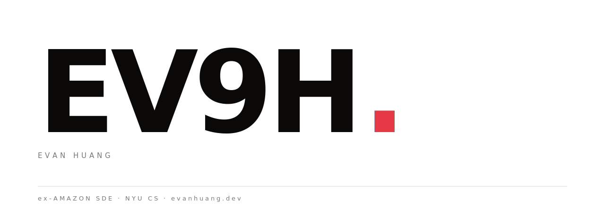

                                                                     
  <picture>                                                                                                                                                                                                                           
    <source media="(prefers-color-scheme: dark)" srcset="./assets/hero-dark.svg">                                                                                                                                                     
                                                                                                                                                              
  </picture>  
  

### Recent... Experiments
- **[Quanti5](https://github.com/EV9H/Quanti5)** - Quant algo momentum trading
- **[ANTIGEN.](https://github.com/EV9H/ANTIGEN.skill)** — a Claude Code skill that makes Claude refuse the AI-generic frontend default. [Live examples](https://ev9h.github.io/antigen-examples/).
- **[World Engine](https://gpt-roundtable.vercel.app/)** — 2D World Live Simulation with multi-agent communication + persistent memory + Maslow drives. AI-Town inspired implementation. 

### Past 

- **[Hatchmark](https://github.com/EV9H/Hatchmark)** a desktop app that use physical key binds to track, analyze habits counter
- **[Agilee](https://agilee.app/)** — Agile-meeting SaaS 
- **[RenterX](https://www.renter-x.com/)** — NYC rental aggregator.
